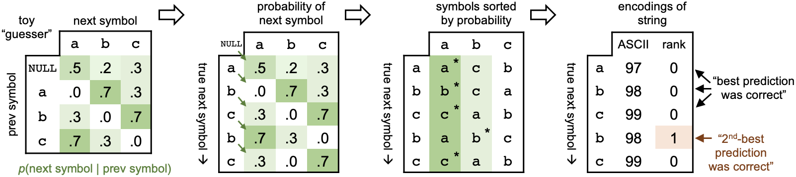
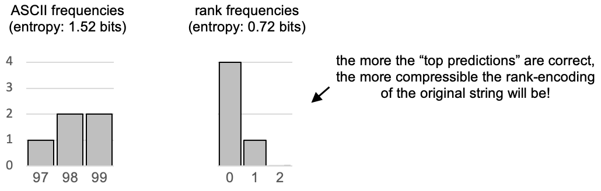

# Text-Compression

# Predictive Compression

This assignment asks you to do text compression using machine learning. Specifically, you're going to train machine learning models to predict "the next symbol" in a string and, by making "the next symbol" more predictable, you will make the string easier to compress. Like most real-world problems, a lot of the work is in understanding the problem setup.

To understand the idea, ask yourself: if you were given 5 symbols, `impor`, what would you guess for the *next symbol*? If those 5 symbols are enough to predict that the next symbol is a `t`, then there's no need to actually store the code for `t`! 

In fact, [Claude Shannon](https://en.wikipedia.org/wiki/Claude_Shannon#/media/File:ClaudeShannon_MFO3807.jpg), the developer of information entropy, performed this exact experiment by asking his human colleagues to "guess the next letter" from context. Read page 1 of Peter Fenwick's [*Symbol Ranking Text Compression with Shannon Recodings*](http://citeseerx.ist.psu.edu/viewdoc/download?doi=10.1.1.50.4148&rep=rep1&type=pdf). Question 3 of this assignment will ask you to implement compression using Shannon's "second method" (symbol rank encoding), where the classifier you trained in Question 2 plays the role of the "guesser". The better the guess, the more compressible the ranks are.

To understand how symbol rank encoding works, **consider a toy example**. Assume the symbol alphabet is $\{a,b,c\}$, for simplicity. A "guesser" receives one "previous symbol" and must guess a probabily for each possible "next symbol." The example guesser shown below (at left) believes that strings like `abcabc` are most probable whereas strings like `aaaaaa` or `bbbbbb` are improbable. The steps below depict how these probabilities are used to rank-encode the example string `[a,b,c,b,c]` as sequence of numbers `[0,0,0,1,0]`.

Notice that, in the rank encoding, the first `b` was encoded as 0, but the second `b` was encoded as 1 because the toy guesser expected `a` to be more probable, based on the previous symbol (i.e., the context).

When symbols are predicted correctly (or approximately-correctly), a rank-encoding is more compressible by a Huffman encoder because the new representation (rank ordinals) has lower information entropy than the original (ASCII ordinals)!

